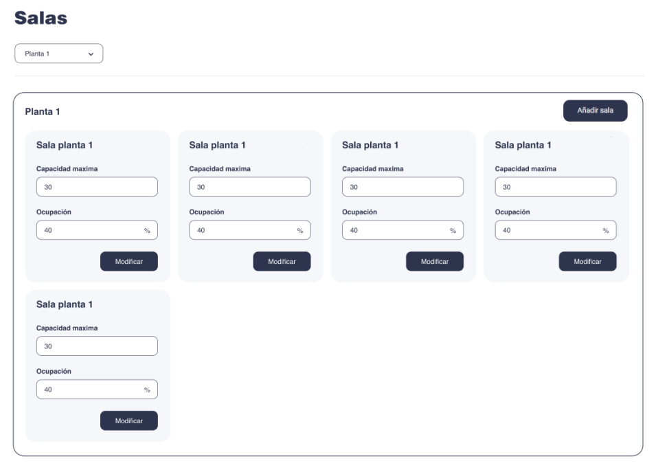

# Challenge-room-control-application

# CHALLENGE

## OBJETIVO

Se quiere llevar un control de las salas que hay en las distintas plantas de un edificio para ver el porcentaje de ocupación y la capacidad máxima que tienen. Además, se debe poder editar esta información, así como añadir nuevas salas o eliminar las existentes.

Para desarrollarlo puedes utilizar Angular, Vue o React; con la que más cómod@ te sientas 😉

## OBLIGATORIO

- Listar salas de una planta seleccionada (mínimo 2 plantas a elegir)
- Añadir nuevas salas a una planta
- Editar la información de una sala

Readme con las siguientes secciones:

- Pasos para arrancar el proyecto
- Explicación de las decisiones que hayas tomado
- Dificultades encontradas

## EXTRAS

- Simular la conexión con backend con una API mockeada (puedes crearla con https://apimocha.com/ u otra plataforma que conozcas)
- Eliminar salas de una planta
- Filtrar las salas por capacidad y ocupación
  Responsive

## RECURSOS

Te adjuntamos el diseño de cómo se vería el listado de salas y algunos valores para conseguir el pixel perfect:

- Colores: azul oscuro (#2E344D) y azul claro (#F5F7FB)
- Border-radius containers: 26px
- Border-radius inputs and buttons: 12px
- Fuente: Helvetica
